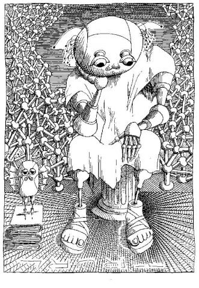

<h3 id="maxwell-header" style="margin-top: -10px; font-weight: bold">Maxwell = Mysql + Kafka</h3>


This is Maxwell's daemon, an application that reads MySQL binlogs and writes row updates to Kafka as JSON.
It's playing in the same space as [mypipe](https://github.com/mardambey/mypipe) and [databus](http://data.linkedin.com/projects/databus),
but differentiates itself with these features:

- Works with an unpatched mysql
- Parses ALTER/CREATE/DROP table statements, which allows Maxwell to always have a correct view of the mysql schema
- Stores its replication position and needed data within the mysql server itself
- Requires no external dependencies (save Kafka, if used)
- Eschews the complexity of Avro for plain old JSON.
- Minimal setup

Maxwell is intended as a source for event-based readers, eg various ETL applications, search indexing,
stat emitters.
<br style="clear:both"/>

```
mysql> insert into `test`.`maxwell` set id = 1, daemon = 'Stanlislaw Lem';

<- {
     "database":"test",
     "table":"maxwell",
     "type":"insert",
     "ts":1449786310,
     "xid":940753,
     "commit":true,
     "data":{ "id":1, "daemon": "Stanlislaw Lem" }
   }

mysql> update test.maxwell set id = 11, daemon = 'firebus!  firebus!';

<- {
     "database":"test",
     "table":"maxwell",
     "type":"update",
     "ts":1449786341,
     "xid":940786,
     "commit":true,
     "data":{"id":11, "daemon":"Firebus!  Firebus!"},
     "old":{"id":1, "daemon":"Stanlislaw Lem"}
   }
```

<script>
  jQuery(document).ready(function () {
    jQuery("#maxwell-header").append(
      jQuery("")

    )
  });
</script>
